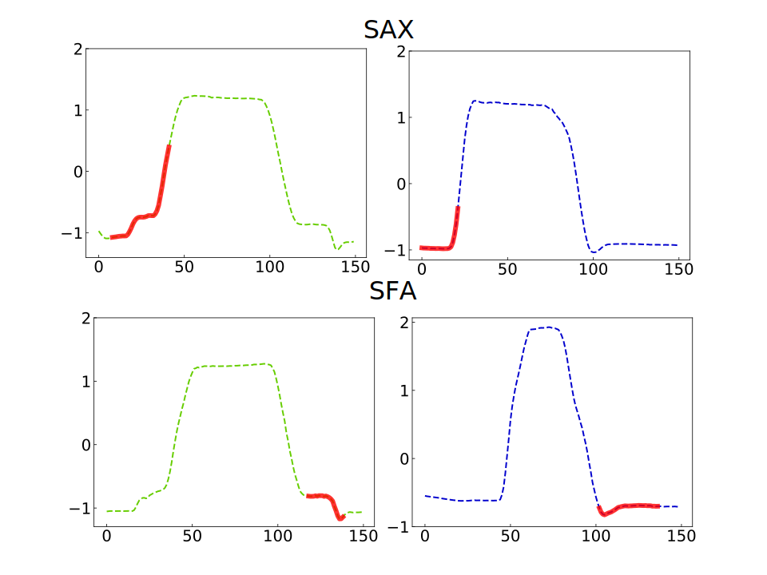
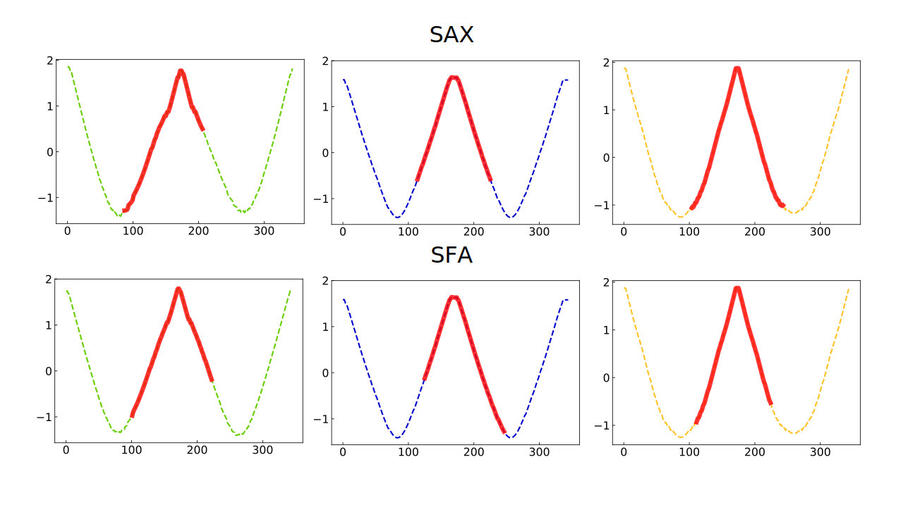
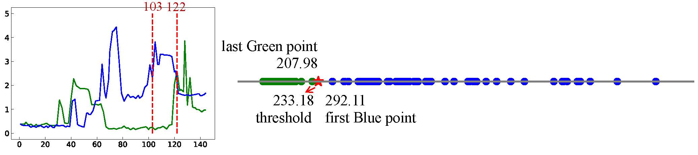
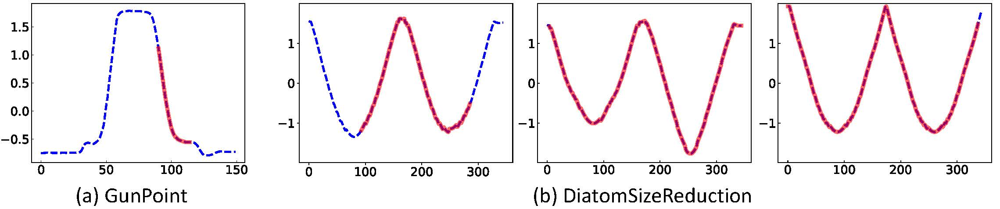

## case study

We illustrate the interpretability of our method through three datasets: GunPoint,  DiatomSizeReduction and PowerCons.

### 1. GunPoint

GunPoint dataset records the motion of an actor drawing a gun. There are two classes in GunPoint: Gun means they hold a prop and Point means just a miming action. Composite features of GunPoint contains SAX and SFA features. We map features to their positions in the original time series, which are agree with prior studied results. The movements of lifting a hand above a holster and the dip in the time series caused by the overshoot phenomena are all captured by composite features. 

Fig.1 Composite features of GunPoint. The two dashed boxes are SAX features and SFA features under different classes (The green line represents Gun and the blue line represents Point).

### 2. DiatomSizeReduction

DiatomSizeReduction describes outlines of four types of diatoms. The original time series in DiatomSizeReduction has no obvious difference in shape and make it difficult to distinguish. However, our composite features can capture tiny differences in the middle bump which are shown in the Fig.2. Since the time series of one class has no obvious features, we finally extract only three classes of features. But according to the voting mechanism given above, it's enough beacuse if a feature judge a data doesn't belong to it, the data will be voted negatively.

Fig.2 Composite features of DiatomSizeReduction. The dashed lines of different colors from left to right indicate different classes.

### 3. PowerCons

PowerCons dataset records the individual household electric power consumption in two season classes of one year, which class 1 is warm and class 2 is cold. We extract RISE features as composite features, and Fig.3 shows an interval of a RISE feature selected for transformation in the left part. Time series of class 1 and class 2 are mapped on the number line, as shown in the right part. It can be clearly seen that the two classes are separated by the threshold of the RISE feature.

Fig.3 In the left part, the green line and blue line shows a time series of class 1 and class 2 respectively, and the red dotted line indicates the interval of RISE feature selection. The right part shows the similarity between PowerCons time series and RISE features. A time series of class 1 represented as a green point and for class 2, is a blue point

### VS FastShapelet

We also compare our composite features with shapelets generated of Fast Shapelet. Fig.4 shows shapelets of GunPoint and Coffee. We agree these shapelets can capture some distinguishing features of data, however, they cannot capture the comprehensive features like ours since shapelet only focuses on time domain features, and the number of shapelets extracted by FS is too small. Like GunPoint, FS can only identify the movement when the actor lowered arms but lacks the movement of lifting a hand.

Fig.4 Shapelets of GunPoint(a) and DiatomSizeReduction(b) generated by FastShapelet.
